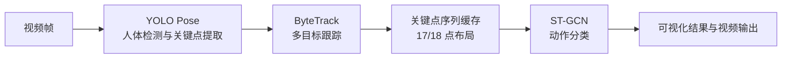

# YOLO Pose + ST-GCN 行为识别系统

本仓库是一套面向视频人体动作识别的工程化项目。系统以定制版 **Ultralytics YOLO** 提取人体框和姿态关键点，使用 **ByteTrack** 保持多目标身份，再通过 **ST-GCN（时空图卷积网络）** 对连续关键点序列进行动作分类。

项目不仅包含训练和推理代码，还提供 PyQt5 图形控制台、17/18 关键点训练方案、模型管理、环境检查、消融实验与结果归档能力，适合从模型实验逐步过渡到可视化应用。

## 处理流程



## 核心能力

- **姿态检测**：基于 Ultralytics YOLO Pose 提取人体框、置信度和 COCO 关键点。
- **多人跟踪**：接入 ByteTrack，在连续帧中维持人员 ID 和动作序列。
- **动作识别**：使用 ST-GCN 对骨骼时序数据进行分类，当前训练配置为 10 类。
- **两套关键点方案**：支持 YOLO Pose 17 点和 OpenPose 18 点数据，并在训练前检查布局兼容性。
- **训练与微调**：支持从头训练、预训练权重初始化、断点继续和迁移微调。
- **定制 YOLO 模块**：优化版源码中重新接入了 `ADown`、`DyRFAUp` 和 `SCSA`，可用于标准化消融实验。
- **桌面控制台**：PyQt5 界面集成环境检测、训练、测试、推理、日志和消融任务管理。
- **工程化管理**：配置、数据、模型、日志和输出分目录保存，核心脚本均使用相对路径。

## 仓库结构

```text
.
├── ProjectOptimization/        # 正式开发与运行工作区
│   ├── configs/                # 训练、推理和 UI 配置
│   ├── data/                   # ST-GCN 关键点数据
│   ├── docs/                   # 运行手册、UI 指南和迁移记录
│   ├── env/                    # Python 3.10 依赖清单
│   ├── models/                 # YOLO 与 ST-GCN 权重
│   ├── outputs/                # 训练、评估和推理结果
│   ├── scripts/                # 环境、训练、推理和工具入口
│   ├── src/ultralytics-main/   # 定制版 Ultralytics 与 ST-GCN 源码
│   └── ui/qt5/                 # PyQt5 图形界面
├── customer/                   # 客户原始代码和数据基线（保持只读）
├── env/                        # 仓库级环境补充文件
└── PROJECT_GUIDE_ZH.md         # 完整中文项目手册
```

> 日常开发、训练和推理都应在 `ProjectOptimization` 中进行；`customer` 只用于对照原始基线，请勿直接修改。

## 环境要求

- Python 3.10
- PyTorch 2.4.1
- Ultralytics 8.3.0
- OpenCV、NumPy、PyYAML
- PyQt5 5.15+
- NVIDIA GPU 与匹配的 CUDA 环境（推荐，但不是环境检查和部分工具的硬性要求）

仓库包含模型权重和数据文件，克隆时请预留足够磁盘空间。完整依赖见 [`ProjectOptimization/env/requirements-py310.txt`](ProjectOptimization/env/requirements-py310.txt)。

## 安装

```bash
git clone https://github.com/Drmufeng/ultralytics.git
cd ultralytics

# 建议在仓库根目录创建统一的 Python 3.10 环境
python -m venv .venv310
```

Windows PowerShell：

```powershell
.\.venv310\Scripts\Activate.ps1
python -m pip install --upgrade pip
pip install -r ProjectOptimization\env\requirements-py310.txt
```

Linux/macOS：

```bash
source .venv310/bin/activate
python -m pip install --upgrade pip
pip install -r ProjectOptimization/env/requirements-py310.txt
```

安装完成后进入工作区：

```bash
cd ProjectOptimization
python scripts/env/check_env.py
```

如需自动补齐依赖并优先配置 GPU，可执行：

```bash
python scripts/env/check_env.py --fix --prefer-gpu
```

## 快速开始

### 启动图形界面

```bash
cd ProjectOptimization
python scripts/tools/run_qt5_app.py
```

界面提供环境与数据检查、训练、模型测试、视频推理、消融实验及实时日志查看，推荐首次使用者从这里开始。

### 视频推理

```bash
cd ProjectOptimization
python scripts/infer/run_pose_stgcn.py \
  --config configs/infer/runtime_out3.json \
  --layout auto
```

也可以通过参数覆盖默认输入和权重：

```bash
python scripts/infer/run_pose_stgcn.py \
  --video-path path/to/input.mp4 \
  --yolo-weights models/yolo/custom/yolo_pose_best.pt \
  --stgcn-weights models/stgcn/out3/best.pt \
  --save-path outputs/infer/result.mp4 \
  --layout auto
```

默认推理结果写入 `ProjectOptimization/outputs/infer/`。

### 训练 ST-GCN

17 关键点方案（YOLO Pose）：

```bash
python scripts/tools/check_keypoint_layout.py \
  --data data/stgcn_dataset_out17/stgcn_dataset_out/train_data.npy \
  --config configs/train/train_stgcn_out17.yaml

python scripts/train/train_stgcn_pretrain.py \
  --config configs/train/train_stgcn_out17.yaml \
  --layout auto
```

18 关键点方案（OpenPose）：

```bash
python scripts/tools/check_keypoint_layout.py \
  --data data/stgcn_dataset_out3/train_data_c3v18.npy \
  --config configs/train/train_stgcn_out3.yaml

python scripts/train/train_stgcn_pretrain.py \
  --config configs/train/train_stgcn_out3.yaml \
  --layout auto
```

使用已有权重微调：

```bash
python scripts/train/train_stgcn_finetune.py \
  --config configs/train/train_stgcn_out3_finetune.yaml \
  --weights models/stgcn/out3/best.pt \
  --layout auto
```

## 关键点布局约束

数据、图结构和模型权重必须使用相同的关键点布局：

| 方案 | 数据关键点数 | 图布局 | 典型配置 |
| --- | ---: | --- | --- |
| YOLO Pose | 17 | `yolopose` | `configs/train/train_stgcn_out17.yaml` |
| OpenPose | 18 | `openpose` | `configs/train/train_stgcn_out3.yaml` |

建议始终使用 `--layout auto` 并在训练前运行 `check_keypoint_layout.py`。混用 17 点数据、18 点权重或错误图布局会导致训练失败，或产生不可用的识别结果。

## 模型与输出

- YOLO 预训练权重：`ProjectOptimization/models/yolo/pretrained/`
- YOLO 自定义权重：`ProjectOptimization/models/yolo/custom/`
- ST-GCN 17 点训练结果：`ProjectOptimization/models/stgcn/out17/`
- ST-GCN 18 点训练结果：`ProjectOptimization/models/stgcn/out3/`
- 消融实验结果：`ProjectOptimization/outputs/eval/ablation/`
- 视频推理结果：`ProjectOptimization/outputs/infer/`
- UI 和任务日志：`ProjectOptimization/logs/run_logs/`

ST-GCN 训练会按配置保存阶段权重，并在验证指标提升时更新 `best.pt`。

## 更多文档

- [完整中文项目手册](PROJECT_GUIDE_ZH.md)
- [ProjectOptimization 工作区说明](ProjectOptimization/README.md)
- [运行手册](ProjectOptimization/docs/runbook.md)
- [UI 使用指南](ProjectOptimization/docs/ui_user_guide_zh.md)
- [模型清单](ProjectOptimization/docs/model_inventory.md)
- [迁移与重构日志](ProjectOptimization/docs/migration_log.md)

