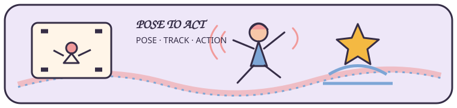

# YOLO Pose + ST-GCN 行为识别系统

## 项目介绍

这个仓库把人体姿态检测、多人跟踪和动作分类串成一条视频处理流程。YOLO Pose 提取人体框和关键点，ByteTrack 在连续画面中维护人员 ID，ST-GCN 根据关键点序列判断动作。

日常开发集中在 ProjectOptimization/。里面有训练、推理、数据检查和 PyQt5 控制台；customer/ 保留原始代码和数据基线，默认只读。

## 处理流程

~~~mermaid
flowchart LR
    A[视频帧] --> B[YOLO Pose]
    B --> C[人体框与关键点]
    C --> D[ByteTrack 多目标跟踪]
    D --> E[关键点序列]
    E --> F[ST-GCN 动作分类]
    F --> G[视频与日志输出]
~~~

## 当前能力

- 从 YOLO Pose 结果中提取人体框、置信度和 COCO 关键点。
- 使用 ByteTrack 维持连续帧中的人员 ID。
- 支持 17 点 YOLO Pose 和 18 点 OpenPose 两套数据布局。
- 提供 ST-GCN 从头训练、预训练初始化、断点续训和迁移微调。
- 保留 ADown、DyRFAUp、SCSA 等定制模块，便于做消融实验。
- PyQt5 控制台可以启动环境检查、训练、测试、推理和日志查看。

## 关键点布局

| 数据方案 | 关键点数 | 图布局 | 常用配置 |
| --- | ---: | --- | --- |
| YOLO Pose | 17 | yolopose | ProjectOptimization/configs/train/train_stgcn_out17.yaml |
| OpenPose | 18 | openpose | ProjectOptimization/configs/train/train_stgcn_out3.yaml |

训练数据、图结构和权重必须使用同一布局。运行训练或推理前，建议先执行 check_keypoint_layout.py。

## 目录

~~~text
ProjectOptimization/
├── configs/                # 训练、推理和 UI 配置
├── data/                   # ST-GCN 关键点数据
├── docs/                   # 运行手册和迁移记录
├── env/                    # Python 3.10 依赖清单
├── models/                 # YOLO 与 ST-GCN 权重
├── outputs/                # 训练、评估和推理结果
├── scripts/                # 环境、训练、推理和工具入口
├── src/ultralytics-main/   # 定制版 Ultralytics 与 ST-GCN 源码
└── ui/qt5/                 # PyQt5 图形界面
customer/                   # 原始代码和数据基线
PROJECT_GUIDE_ZH.md         # 中文项目手册
~~~

## 环境和安装

- Python 3.10
- PyTorch 2.4.1
- Ultralytics 8.3.0
- OpenCV、NumPy、PyYAML、PyQt5 5.15+
- NVIDIA GPU（推荐，环境检查和部分工具也可在 CPU 上运行）

~~~bash
git clone https://github.com/Drmufeng/ultralytics.git
cd ultralytics
python -m venv .venv310
~~~

Windows PowerShell：

~~~powershell
.\.venv310\Scripts\Activate.ps1
python -m pip install --upgrade pip
pip install -r ProjectOptimization\env\requirements-py310.txt
cd ProjectOptimization
python scripts/env/check_env.py
~~~

Linux/macOS 使用 .venv310/bin/activate，依赖文件路径为 ProjectOptimization/env/requirements-py310.txt。

## 快速开始

### 启动控制台

~~~bash
cd ProjectOptimization
python scripts/tools/run_qt5_app.py
~~~

首次运行可以从环境与数据检查开始。

### 视频推理

~~~bash
cd ProjectOptimization
python scripts/infer/run_pose_stgcn.py --config configs/infer/runtime_out3.json --layout auto
~~~

结果默认写入 ProjectOptimization/outputs/infer/。也可以用 --video-path、--yolo-weights、--stgcn-weights 和 --save-path 覆盖默认值。

### 训练 ST-GCN

~~~bash
cd ProjectOptimization
python scripts/tools/check_keypoint_layout.py --data data/stgcn_dataset_out17/stgcn_dataset_out/train_data.npy --config configs/train/train_stgcn_out17.yaml
python scripts/train/train_stgcn_pretrain.py --config configs/train/train_stgcn_out17.yaml --layout auto
~~~

18 点方案使用 out3 配置和对应数据。微调时再运行 train_stgcn_finetune.py 并传入已有权重。

## 输出位置

- YOLO 权重：ProjectOptimization/models/yolo/
- ST-GCN 权重：ProjectOptimization/models/stgcn/out17/ 与 out3/
- 消融实验：ProjectOptimization/outputs/eval/ablation/
- 推理视频：ProjectOptimization/outputs/infer/
- 运行日志：ProjectOptimization/logs/run_logs/

### 从哪里开始

| 你准备做什么 | 建议入口 |
| --- | --- |
| 第一次运行项目 | 启动 PyQt5 控制台，先做环境和数据检查 |
| 运行视频推理 | ProjectOptimization/scripts/infer/run_pose_stgcn.py |
| 训练动作分类器 | ProjectOptimization/scripts/train/ |
| 查看完整说明 | [中文项目手册](PROJECT_GUIDE_ZH.md) |

## 文档

- [完整中文项目手册](PROJECT_GUIDE_ZH.md)
- [工作区说明](ProjectOptimization/README.md)
- [运行手册](ProjectOptimization/docs/runbook.md)
- [UI 使用指南](ProjectOptimization/docs/ui_user_guide_zh.md)
- [模型清单](ProjectOptimization/docs/model_inventory.md)
- [迁移与重构日志](ProjectOptimization/docs/migration_log.md)

## 许可

本项目采用 [MIT License](LICENSE)。模型权重、数据集和第三方依赖按各自的许可证使用。
